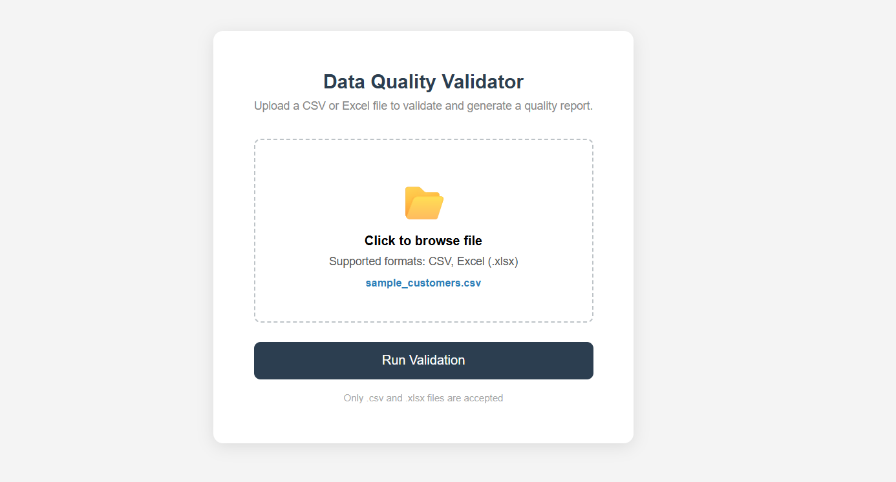
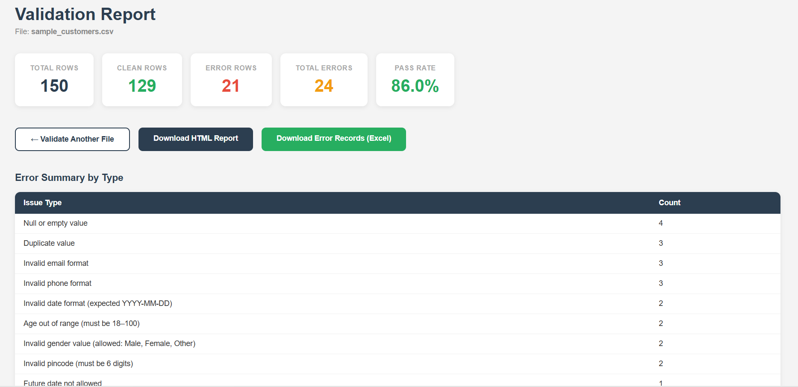
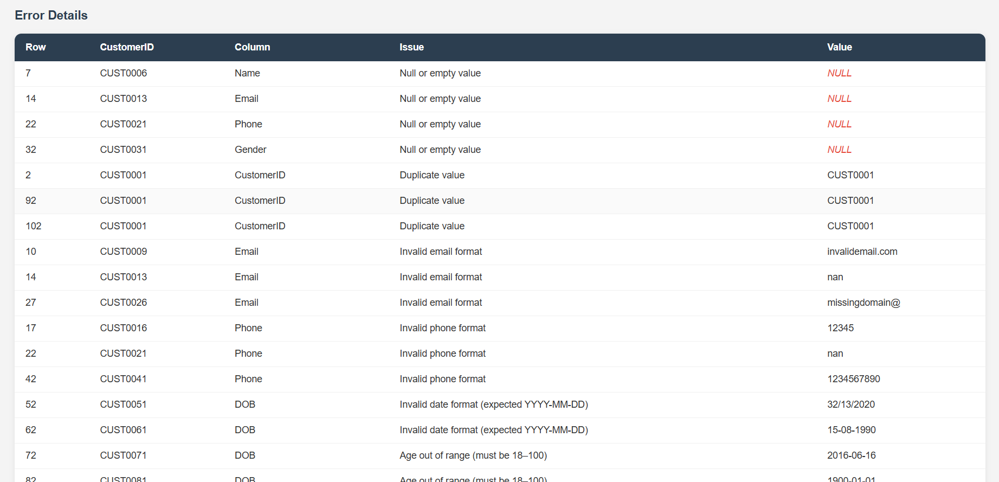
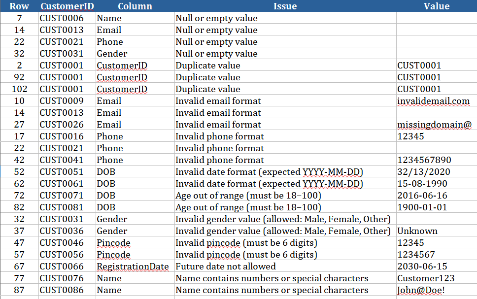

# Data Quality Validation Engine

A Python-based data quality validation tool that validates CSV and Excel files against 10 business rules and generates a detailed HTML report with an Excel error export.

---

## Screenshots

### Upload Page


### Validation Report



### Error Records Export


---

## Tech Stack

| Layer | Technology |
|---|---|
| Backend | Python, Flask |
| Data Processing | Pandas |
| Excel Export | openpyxl |
| Frontend | HTML, CSS |

---

## Features

- Upload CSV or Excel (.xlsx) files via browser
- 10 validation checks covering data quality rules
- Visual HTML report with summary cards and error details
- Excel export of all error records
- Clean, modular codebase — all rules configurable from `config.py`

---

## Validation Rules

| # | Check | Column | Rule |
|---|---|---|---|
| 1 | Null Check | All columns | No missing or empty values allowed |
| 2 | Duplicate Check | CustomerID | Must be unique across all records |
| 3 | Email Format | Email | Must match `name@domain.com` pattern |
| 4 | Phone Format | Phone | 10 digits, must start with 6, 7, 8, or 9 (Indian format) |
| 5 | Date Format | DOB, RegistrationDate | Must follow `YYYY-MM-DD` format |
| 6 | Age Validity | DOB | Age must be between 18 and 100 years |
| 7 | Gender Values | Gender | Only `Male`, `Female`, or `Other` allowed |
| 8 | Pincode Format | Pincode | Must be exactly 6 digits |
| 9 | Future Date Check | RegistrationDate | Registration date cannot be a future date |
| 10 | Name Check | Name | Must not contain numbers or special characters |

---

## Project Structure

```
data_quality_validator/
│
├── app.py                        # Flask entry point
├── config.py                     # Validation rules and configuration
├── requirements.txt
│
├── validator/
│   ├── __init__.py
│   ├── extractor.py              # Read CSV/Excel into DataFrame
│   ├── null_checker.py           # Null and empty value checks
│   ├── duplicate_checker.py      # Duplicate record checks
│   ├── format_validator.py       # Email, phone, date, age, gender, pincode, name checks
│   └── report_generator.py       # Generate HTML report and Excel error export
│
├── templates/
│   ├── index.html                # Upload page
│   └── report.html               # Validation result page
│
├── sample_data/
│   └── sample_customers.csv      # Sample dataset with intentional errors for testing
│
├── screenshots/                  # UI screenshots for README
├── uploads/                      # Uploaded files (gitignored)
├── reports/                      # Generated HTML reports (gitignored)
└── exports/                      # Excel error exports (gitignored)
```

---

## Pipeline Flow

```
User Uploads CSV / Excel
        ↓
    Extract (Pandas)
        ↓
    Null Check
        ↓
    Duplicate Check
        ↓
    Format Validations (Email, Phone, DOB, Age, Gender, Pincode, Name, Future Date)
        ↓
    Generate HTML Validation Report
        ↓
    Export Error Records to Excel
```

---

## Sample Dataset

A sample dataset (`sample_data/sample_customers.csv`) with 150 rows is included.
It contains intentional errors across all 10 validation types for testing purposes.

| Error Type | Row(s) |
|---|---|
| Null Name | 6 |
| Null Email | 13 |
| Null Phone | 21 |
| Null Gender | 31 |
| Invalid email format | 9, 26 |
| Invalid phone format | 16, 41 |
| Invalid DOB format | 51, 61 |
| Age out of range | 71, 81 |
| Duplicate CustomerID | 91, 101 |
| Invalid Gender value | 36 |
| Invalid Pincode | 46, 56 |
| Future RegistrationDate | 66 |
| Name with numbers/special chars | 76, 86 |

---

## What the Report Shows

- **Total Rows** — number of records in the file
- **Clean Rows** — records that passed all validations
- **Error Rows** — records that failed at least one validation
- **Total Errors** — total number of individual validation failures
- **Pass Rate** — percentage of clean records
- **Error Summary** — grouped count of each error type
- **Error Details** — row-level breakdown with CustomerID, column, issue, and value

---

## Skills Demonstrated

- Python scripting and modular code design
- Data validation with Pandas
- ETL concepts — Extract, Validate, Transform, Report
- Flask web framework
- Excel file processing with openpyxl
- HTML report generation
- Git version control

---

## Future Enhancements

- Azure Blob Storage integration for cloud file ingestion
- Database logging of validation results
- REST API endpoint for pipeline integration
- Configurable rules via UI without editing `config.py`

---

## Author

**Shanmugapriya**  
M.Sc. Computer Science | Data Engineering Enthusiast  
[LinkedIn](https://www.linkedin.com/in/shanmugapriya-p-713b6a26a)
